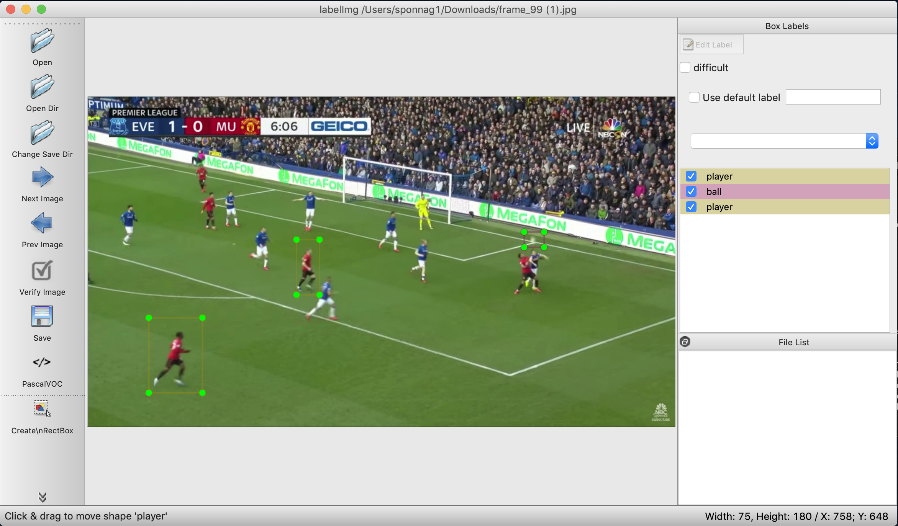

<h1>Soccer Analytics</h1>

The intent of this idea is to learn and apply machine learning to generate relative coordinates of players and the ball on a 
soccer field. The approach taken can be broken down into 4 big buckets
1. Identify players and ball in a video
2. Classify into two separate teams
3. Identify lines and boundaries and intersection points
4. Find camera panning and angles to generate coordinates

<h2> Identifying players and ball</h2>

The <b>cleaned_images_train</b> and <b>clearned_images_test</b> contains random images drawn from a YouTube video which will be used to train and test the model. These images need to be annotated. For annotation, <a href="https://github.com/tzutalin/labelImg"> labellImg </a> was used.

This generates XML data that needs to be converted to Tensorflow records. There is a good tutorial <a href="https://github.com/EdjeElectronics/TensorFlow-Object-Detection-API-Tutorial-Train-Multiple-Objects-Windows-10">here</a> by EdjeElectronics which has been heavily used during this step.

